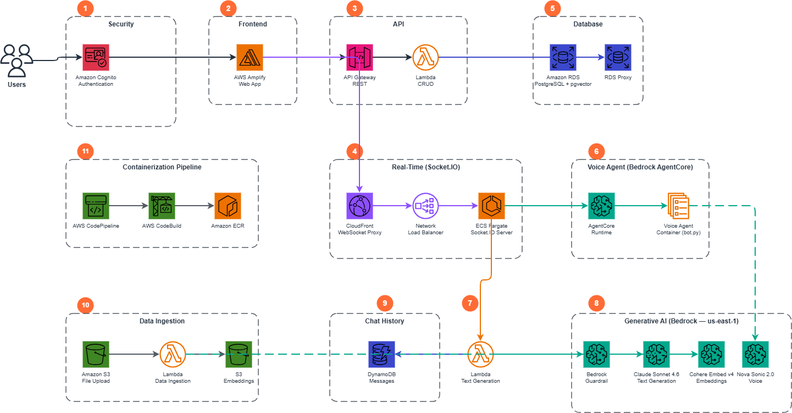

# Architecture Deep Dive

This document provides a high-level overview of the GenRx system architecture and a complete reference of the database schema.

---

## Architecture



The GenRx platform is composed of the following layers:

1. **Edge & Security** — CloudFront sits in front of the Socket.IO server (NLB origin) to provide HTTPS termination and WebSocket proxying. All traffic enters through HTTPS endpoints. Cognito handles authentication and a Bedrock Guardrail screens user input/AI output for content safety.

2. **Frontend Hosting** — A React SPA built with Vite is hosted on AWS Amplify. Amplify auto-builds from the `main` branch on push. The app uses Tailwind CSS, shadcn/ui components, and communicates with the backend via REST API and WebSocket connections.

3. **Authentication** — Amazon Cognito User Pool handles sign-up, sign-in, and email verification. A custom Lambda authorizer (`jwtAuthorizer.js`) validates JWTs on every API request and injects `userId` and `email` into the request context. Roles are stored in the database (not JWT claims).

4. **API Layer** — Amazon API Gateway (REST) routes requests to monolithic Lambda handlers per role: `studentFunction.js`, `instructorFunction.js`, and `adminFunction.js`. Each handler uses `httpMethod + resource` switch routing. An OpenAPI/Swagger definition drives the API Gateway configuration.

5. **Real-time Streaming** — Both text chat and voice flow through a Socket.IO server running on ECS Fargate. The frontend establishes a single WebSocket connection (via CloudFront → NLB → ECS) for all real-time communication. For text chat, the Socket.IO server invokes the Text Generation Lambda and streams response tokens back to the client. This unified WebSocket approach replaced an earlier AppSync-based design, providing consistent low-latency streaming and a single connection point for both modalities.

6. **Data Persistence** — Amazon RDS PostgreSQL 16 (Multi-AZ, encrypted at rest) stores all application data. Three RDS Proxy instances (user, table creator, admin) pool connections. The `pgvector` extension enables semantic similarity search on document embeddings.

7. **Object Storage** — Amazon S3 stores uploaded persona documents (PDFs) and generated embeddings. Pre-signed URLs provide secure, time-limited access for uploads and downloads.

8. **AI Services** — Amazon Bedrock provides LLM inference (Claude Sonnet 4.6 via cross-region inference profile `us.anthropic.claude-sonnet-4-6`), text embeddings (Cohere Embed v4 `cohere.embed-v4:0`), content evaluation (Nova Lite), and voice interactions (Nova Sonic 2.0). All model calls are routed to `us-east-1` regardless of deployment region. A Docker Lambda (`text_generation`) handles chat, debrief generation, and semantic question matching via LangChain. A separate Docker Lambda (`data_ingestion`) processes uploaded PDFs into vector embeddings.

9. **Voice Agent** — The voice pipeline uses Amazon Bedrock AgentCore to host a containerized voice agent (`cdk/voice-agent/bot.py`). The ECS Socket.IO server connects to AgentCore via a SigV4-authenticated WebSocket, relaying audio frames between the frontend and the voice agent. The voice agent container uses Nova Sonic 2.0's bidirectional streaming API for real-time speech-to-speech interaction. A TURN server stack exists in the CDK deployment but is effectively dead code — it was provisioned for a WebRTC-based approach that was superseded by the AgentCore design. It remains available if anyone wants to explore WebRTC in the future; see the [Voice Agent Deep Dive](./VOICE_AGENT_DEEP_DIVE.md) for design decision context.

10. **CI/CD** — AWS CodePipeline triggers on GitHub pushes. CodeBuild projects build Docker images for each service module, push to ECR, run vulnerability scans, and update Lambda function code. Amplify handles frontend CI/CD independently.

---

## Database Schema

The database runs PostgreSQL 16 with the `uuid-ossp` and `vector` (pgvector) extensions enabled. All primary keys are UUIDs generated by `uuid_generate_v4()`.

---

##### organizations

Top-level grouping for institutions (universities, programs).

| Column | Type | Description |
|--------|------|-------------|
| organization_id | uuid (PK) | Unique identifier |
| name | varchar | Organization name |
| type | varchar | Organization type |
| created_at | timestamp | Creation timestamp |
| description | text | Organization description |
| ai_persona | varchar | Display label for AI characters (default: 'Patient') |
| user_role | varchar | Display label for users (default: 'Student') |
| icon_color | varchar | Brand color for UI (default: '#03045E') |
| system_prompt | text | Organization-level default system prompt |

---

##### users

User accounts with roles and organization affiliation.

| Column | Type | Description |
|--------|------|-------------|
| user_id | uuid (PK) | Unique identifier |
| organization_id | uuid (FK → organizations) | Organization membership |
| user_email | varchar (UNIQUE) | Login email |
| first_name | varchar | First name |
| last_name | varchar | Last name |
| time_account_created | timestamptz | Account creation time |
| roles | varchar[] | Role array (default: ['student']) |
| last_sign_in | timestamptz | Last login timestamp |
| username | varchar | Display username |

---

##### simulation_groups

Instructor-created scenarios containing patient personas and enrolled students.

| Column | Type | Description |
|--------|------|-------------|
| simulation_group_id | uuid (PK) | Unique identifier |
| organization_id | uuid (FK → organizations) | Parent organization |
| created_by | uuid (FK → users) | Instructor who created the group |
| group_name | varchar | Display name |
| group_description | varchar | Description text |
| group_access_code | varchar | Code students use to join |
| group_student_access | boolean | Whether students can currently access |
| system_prompt | text | System prompt for AI interactions |
| instructor_voice_enabled | boolean | Whether voice is enabled (default: true) |
| debrief_prompt | text | Custom debrief evaluation prompt |
| max_messages_per_chat | integer | Per-chat message limit (NULL = unlimited) |

---

##### group_instructors

Mapping of instructors to simulation groups (many-to-many).

| Column | Type | Description |
|--------|------|-------------|
| group_instructor_id | uuid (PK) | Unique identifier |
| simulation_group_id | uuid (FK → simulation_groups) | Group reference |
| user_id | uuid (FK → users) | Instructor reference |
| added_by | uuid (FK → users) | Who added this instructor |
| added_at | timestamp | When the instructor was added |

Constraints: UNIQUE(simulation_group_id, user_id)

---

##### personas

AI patient characters within simulation groups.

| Column | Type | Description |
|--------|------|-------------|
| persona_id | uuid (PK) | Unique identifier |
| simulation_group_id | uuid (FK → simulation_groups) | Parent group |
| persona_name | varchar | Character name |
| persona_age | integer | Character age |
| persona_gender | varchar | Character gender |
| persona_number | integer | Display order number |
| persona_prompt | text | Character-specific prompt |
| average_wpm | integer | Speech rate for voice |
| voice_id | varchar | TTS voice identifier (default: 'tiffany') |
| interaction_mode | varchar | Interaction mode setting |
| llm_completion | boolean | Whether LLM completion is enabled |
| voice_enabled | boolean | Whether voice is enabled for this persona (default: true) |

---

##### persona_media

Media files (images, documents) associated with personas.

| Column | Type | Description |
|--------|------|-------------|
| media_id | uuid (PK) | Unique identifier |
| persona_id | uuid (FK → personas) | Parent persona |
| media_type | varchar | File type (e.g., 'image', 'document') |
| url | varchar | Storage URL |
| title | varchar | Display title |
| description | text | Description |
| created_at | timestamp | Upload timestamp |

---

##### persona_data

Uploaded knowledge base files (PDFs) ingested into the vector store.

| Column | Type | Description |
|--------|------|-------------|
| file_id | uuid (PK) | Unique identifier |
| persona_id | uuid (FK → personas) | Parent persona |
| filetype | varchar | File extension/type |
| s3_bucket_reference | varchar | S3 bucket name |
| filepath | varchar | S3 object key |
| filename | varchar | Original filename |
| time_uploaded | timestamp | Upload timestamp |
| metadata | text | Extracted metadata |
| file_number | integer | Display order |
| ingestion_status | varchar(20) | Processing status (default: 'not processing') |
| display_name | varchar | User-facing file name |

---

##### rubrics

Assessment rubrics for simulation groups/personas.

| Column | Type | Description |
|--------|------|-------------|
| rubric_id | uuid (PK) | Unique identifier |
| simulation_group_id | uuid (FK → simulation_groups) | Parent group |
| persona_id | uuid (FK → personas) | Associated persona |
| name | varchar | Rubric name |
| description | text | Rubric description |
| created_at | timestamp | Creation timestamp |

---

##### key_questions

Assessment questions within rubrics (legacy — superseded by question_bank).

| Column | Type | Description |
|--------|------|-------------|
| question_id | uuid (PK) | Unique identifier |
| rubric_id | uuid (FK → rubrics) | Parent rubric |
| question_text | text | Question content |
| category | varchar | Question category |
| order | integer | Display order |
| weight | float | Scoring weight |
| max_score | integer | Maximum possible score |

---

##### enrollments

Student enrollment in simulation groups.

| Column | Type | Description |
|--------|------|-------------|
| enrollment_id | uuid (PK) | Unique identifier |
| user_id | uuid (FK → users) | Student reference |
| simulation_group_id | uuid (FK → simulation_groups) | Group reference |
| enrollment_type | varchar | Type of enrollment |
| group_completion_percentage | integer | Progress percentage |
| time_enrolled | timestamp | Enrollment timestamp |

Constraints: UNIQUE(simulation_group_id, user_id)

---

##### student_interactions

Per-persona interaction session for a student within an enrollment.

| Column | Type | Description |
|--------|------|-------------|
| student_interaction_id | uuid (PK) | Unique identifier |
| persona_id | uuid (FK → personas) | Persona being interacted with |
| enrollment_id | uuid (FK → enrollments) | Parent enrollment |
| persona_score | integer | Aggregate score for this persona |
| last_accessed | timestamp | Last activity timestamp |
| persona_context_embedding | float[] | Vector embedding of interaction context |
| is_completed | boolean | Whether the interaction is complete (default: false) |

Constraints: UNIQUE(persona_id, enrollment_id)

---

##### chats

Individual chat sessions between a student and an AI persona.

| Column | Type | Description |
|--------|------|-------------|
| chat_id | uuid (PK) | Unique identifier |
| student_interaction_id | uuid (FK → student_interactions) | Parent interaction |
| chat_name | varchar | Display name |
| chat_context_embeddings | float[] | Vector embedding of chat context |
| last_accessed | timestamp | Last activity timestamp |
| notes | text | Student notes |
| started_at | timestamptz | Session start time |
| ended_at | timestamptz | Session end time |
| status | varchar | Session status: 'active', 'concluded', or 'expired' |
| recommendation | text | Student's recommendation submitted on conclude |
| dtp_submission | jsonb | Array of DTP strings submitted by the student |
| recommendation_submission | jsonb | Array of {recommendation, rationale} objects submitted on conclude |

---

##### messages

Individual messages within a chat session.

| Column | Type | Description |
|--------|------|-------------|
| message_id | uuid (PK) | Unique identifier |
| chat_id | uuid (FK → chats) | Parent chat |
| sender_type | varchar | Who sent: 'student', 'ai', or 'system' |
| user_id | uuid | Sender's user ID |
| message_content | text | Message body |
| sent_at | timestamptz | When the message was sent |
| matched_question_ids | jsonb | Array of {question_id, similarity_score} matches |

---

##### debriefs

AI-generated evaluations of student chat performance.

| Column | Type | Description |
|--------|------|-------------|
| debrief_id | uuid (PK) | Unique identifier |
| chat_id | uuid (FK → chats, UNIQUE) | One debrief per chat |
| generated_text | text | Full debrief JSON output |
| missing_key_questions | jsonb | Questions the student missed |
| reasoning_gaps | text | Identified reasoning gaps |
| rubric_scores | jsonb | Per-rubric scoring data |
| created_at | timestamp | Generation timestamp |
| student_id | uuid (FK → users) | Student who was evaluated |
| persona_id | uuid (FK → personas) | Persona in the interaction |
| simulation_group_id | uuid (FK → simulation_groups) | Parent group |
| total_questions_assigned | integer | Number of questions assigned |
| total_questions_asked | integer | Number of questions addressed |
| total_questions_missed | integer | Number of questions missed |
| overall_score | float | Aggregate score (0.0–100.0) |

---

##### feedback

Student feedback on chat sessions (legacy).

| Column | Type | Description |
|--------|------|-------------|
| feedback_id | uuid (PK) | Unique identifier |
| chat_id | uuid (FK → chats) | Related chat |
| score | integer | Feedback score |
| analysis | text | Feedback analysis text |
| areas_for_improvement | varchar[] | Improvement suggestions |
| submitted_at | timestamp | Submission timestamp |

---

##### user_engagement_log

Audit trail of user engagement events.

| Column | Type | Description |
|--------|------|-------------|
| log_id | uuid (PK) | Unique identifier |
| user_id | uuid (FK → users) | User who performed the action |
| simulation_group_id | uuid (FK → simulation_groups) | Related group |
| persona_id | uuid (FK → personas) | Related persona |
| enrollment_id | uuid (FK → enrollments) | Related enrollment |
| timestamp | timestamp | Event timestamp |
| engagement_type | varchar | Type of engagement event |
| engagement_details | text | Event details |

---

##### system_prompt_history

Audit trail of organization-level system prompt changes.

| Column | Type | Description |
|--------|------|-------------|
| history_id | uuid (PK) | Unique identifier |
| modified_by | uuid (FK → users) | User who made the change |
| organization_id | uuid (FK → organizations) | Organization reference |
| prompt_content | text | Prompt content at time of change |
| created_at | timestamp | Change timestamp |

---

##### question_bank

Organization-scoped repository of assessment questions.

| Column | Type | Description |
|--------|------|-------------|
| question_id | uuid (PK) | Unique identifier |
| organization_id | uuid (FK → organizations) | Parent organization |
| created_by | uuid (FK → users) | Creator |
| title | varchar(255) | Question title |
| question_text | text | Full question content |
| evaluation_criteria | text | How to evaluate student responses |
| category | varchar(100) | Question category |
| difficulty_level | varchar(50) | Difficulty level |
| is_mandatory | boolean | Whether the question must be asked (default: false) |
| weight | float | Scoring weight (default: 1.0) |
| max_score | integer | Maximum score (default: 100) |
| is_active | boolean | Soft-delete flag (default: true) |
| created_at | timestamp | Creation timestamp |
| tags | varchar[] | Flexible categorization tags (default: '{}') |

---

##### simulation_group_questions

Links questions from the bank to specific simulation groups, with optional persona-level specificity.

| Column | Type | Description |
|--------|------|-------------|
| group_question_id | uuid (PK) | Unique identifier |
| simulation_group_id | uuid (FK → simulation_groups) | Target group |
| persona_id | uuid (FK → personas) | Target persona (NULL = group-level) |
| question_id | uuid (FK → question_bank) | Question reference |
| weight_override | float | Override the question's default weight |
| max_score_override | integer | Override the question's default max score |
| order | integer | Display/evaluation order (default: 0) |
| added_by | uuid (FK → users) | Who assigned the question |
| added_at | timestamp | Assignment timestamp |

Constraints: UNIQUE(simulation_group_id, persona_id, question_id)

---

##### question_interactions

Per-question tracking of student interactions during chat.

| Column | Type | Description |
|--------|------|-------------|
| interaction_id | uuid (PK) | Unique identifier |
| chat_id | uuid (FK → chats) | Related chat session |
| question_id | uuid (FK → question_bank) | Question being tracked |
| student_id | uuid (FK → users) | Student |
| persona_id | uuid (FK → personas) | Persona in the interaction |
| simulation_group_id | uuid (FK → simulation_groups) | Parent group |
| was_asked | boolean | Whether the student asked this question (default: false) |
| is_correct | boolean | Whether the response was correct |
| message_id | uuid | Message that triggered the match |
| quality_score | integer | Quality assessment score |
| quality_feedback | text | Quality assessment feedback |
| semantic_similarity_score | float | Cosine similarity score |
| asked_at | timestamp | When the question was asked |
| time_to_ask_seconds | integer | Time from chat start to asking |
| attempt_number | integer | Which attempt (default: 1) |
| created_at | timestamp | Record creation timestamp |
| updated_at | timestamp | Last update timestamp |

---

##### debrief_prompt_history

Audit trail of debrief prompt changes per simulation group.

| Column | Type | Description |
|--------|------|-------------|
| history_id | uuid (PK) | Unique identifier |
| modified_by | uuid (FK → users) | User who made the change |
| simulation_group_id | uuid (FK → simulation_groups) | Group reference |
| prompt_content | text | Prompt content at time of change |
| created_at | timestamp | Change timestamp |

---

##### debrief_feedback

Student feedback on debrief quality (thumbs up/down with optional comment).

| Column | Type | Description |
|--------|------|-------------|
| feedback_id | uuid (PK) | Unique identifier |
| simulation_group_id | uuid (FK → simulation_groups) | Group context |
| persona_id | uuid (FK → personas) | Persona context |
| chat_id | uuid (FK → chats) | Related chat |
| user_id | uuid (FK → users) | Student who submitted |
| is_helpful | boolean | Whether the debrief was helpful |
| comment | text | Optional comment |
| submitted_at | timestamptz | Submission timestamp |

---

##### issue_reports

Student-submitted issue/bug reports during simulations.

| Column | Type | Description |
|--------|------|-------------|
| report_id | uuid (PK) | Unique identifier |
| simulation_group_id | uuid (FK → simulation_groups) | Group context |
| persona_id | uuid (FK → personas) | Persona context |
| chat_id | uuid (FK → chats) | Related chat |
| user_id | uuid (FK → users) | Reporter |
| issue_categories | varchar[] | Category tags for the issue |
| details | text | Issue description |
| submitted_at | timestamptz | Submission timestamp |

---

##### dtp_bank

Organization-scoped Drug Therapy Problem repository.

| Column | Type | Description |
|--------|------|-------------|
| dtp_id | uuid (PK) | Unique identifier |
| organization_id | uuid (FK → organizations) | Parent organization |
| created_by | uuid (FK → users) | Creator |
| title | varchar(255) | DTP title |
| expected_dtp_text | text | Expected DTP text for matching |
| clinical_intent | text | Clinical intent description |
| evaluation_criteria | text | How to evaluate student responses |
| tags | text[] | Categorization tags (default: '{}') |
| is_required | boolean | Whether this DTP is required (default: false) |
| is_active | boolean | Soft-delete flag (default: true) |
| created_at | timestamp | Creation timestamp |

---

##### recommendations_bank

Organization-scoped Recommendation repository.

| Column | Type | Description |
|--------|------|-------------|
| recommendation_id | uuid (PK) | Unique identifier |
| organization_id | uuid (FK → organizations) | Parent organization |
| created_by | uuid (FK → users) | Creator |
| title | varchar(255) | Recommendation title |
| recommendation_text | text | Expected recommendation text for matching |
| evaluation_criteria | text | How to evaluate student responses |
| rationale | text | Expected rationale for the recommendation |
| is_active | boolean | Soft-delete flag (default: true) |
| created_at | timestamp | Creation timestamp |

---

##### simulation_group_dtps

Links DTP items from the bank to specific simulation groups, with optional persona-level specificity.

| Column | Type | Description |
|--------|------|-------------|
| group_dtp_id | uuid (PK) | Unique identifier |
| simulation_group_id | uuid (FK → simulation_groups) | Target group |
| persona_id | uuid (FK → personas) | Target persona (NULL = group-level) |
| dtp_id | uuid (FK → dtp_bank) | DTP reference |
| sort_order | integer | Display/evaluation order (default: 0) |
| added_by | uuid (FK → users) | Who assigned the DTP |
| added_at | timestamp | Assignment timestamp |

Constraints: UNIQUE(simulation_group_id, persona_id, dtp_id)

---

##### simulation_group_recommendations

Links Recommendation items from the bank to specific simulation groups, with optional persona-level specificity.

| Column | Type | Description |
|--------|------|-------------|
| group_recommendation_id | uuid (PK) | Unique identifier |
| simulation_group_id | uuid (FK → simulation_groups) | Target group |
| persona_id | uuid (FK → personas) | Target persona (NULL = group-level) |
| recommendation_id | uuid (FK → recommendations_bank) | Recommendation reference |
| sort_order | integer | Display/evaluation order (default: 0) |
| added_by | uuid (FK → users) | Who assigned the recommendation |
| added_at | timestamp | Assignment timestamp |

Constraints: UNIQUE(simulation_group_id, persona_id, recommendation_id)

---

## Entity Relationship Summary

```
organizations (1) ──── (N) users
organizations (1) ──── (N) simulation_groups
organizations (1) ──── (N) question_bank
organizations (1) ──── (N) dtp_bank
organizations (1) ──── (N) recommendations_bank

simulation_groups (1) ──── (N) personas
simulation_groups (1) ──── (N) enrollments
simulation_groups (1) ──── (N) group_instructors
simulation_groups (1) ──── (N) simulation_group_questions
simulation_groups (1) ──── (N) simulation_group_dtps
simulation_groups (1) ──── (N) simulation_group_recommendations

personas (1) ──── (N) persona_data
personas (1) ──── (N) persona_media

enrollments (1) ──── (N) student_interactions
student_interactions (1) ──── (N) chats

chats (1) ──── (N) messages
chats (1) ──── (1) debriefs

question_bank (1) ──── (N) simulation_group_questions
question_bank (1) ──── (N) question_interactions

dtp_bank (1) ──── (N) simulation_group_dtps
recommendations_bank (1) ──── (N) simulation_group_recommendations
```
