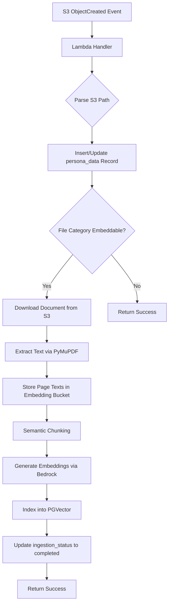

# Data Ingestion Pipeline

> **Type:** Technical Reference
> **Last updated:** 2026-05-30

## Table of Contents

- [Overview](#overview)
- [Ingestion Pipeline Architecture](#ingestion-pipeline-architecture)
- [Document Processing Flow](#document-processing-flow)
- [Vector Store Schema](#vector-store-schema)
- [Troubleshooting](#troubleshooting)
- [Cross-References](#cross-references)

## Overview

The data ingestion pipeline processes persona case materials (PDFs and other document formats) uploaded by instructors into vector embeddings stored in PostgreSQL with the pgvector extension. This enables retrieval-augmented generation (RAG) during student-patient chat interactions.

The pipeline runs as a Docker-based AWS Lambda function triggered by S3 object events. When an instructor uploads a document to a persona's folder in S3, the Lambda function extracts text, splits it into semantic chunks, generates embeddings via Amazon Bedrock, and stores the resulting vectors in the PostgreSQL database through RDS Proxy.

### Key Characteristics

- **Event-driven**: Triggered automatically by S3 `ObjectCreated` and `ObjectRemoved` events
- **Idempotent**: Tracks ingestion status per file to avoid reprocessing completed documents
- **Multi-format**: Supports PDF, DOCX, PPTX, TXT, XLSX, XPS, MOBI, and CBZ via PyMuPDF
- **Incremental indexing**: Uses LangChain's `SQLRecordManager` with incremental cleanup to manage document lifecycle

## Ingestion Pipeline Architecture

### Component Overview

The pipeline consists of four layers:

1. **Event Source** — S3 bucket notifications trigger the Lambda on file upload or deletion
2. **Lambda Handler** (`main.py`) — Orchestrates the workflow: parses the S3 event, manages database records, and delegates to processing modules
3. **Document Processing** (`processing/documents.py`) — Extracts text from documents, splits into semantic chunks, and indexes into the vector store
4. **Vector Store Layer** (`helpers/`) — Initializes PGVector, manages embeddings, and handles the Bedrock embedding model client

### Infrastructure Dependencies

| Component | Service | Purpose |
|-----------|---------|---------|
| Compute | AWS Lambda (Docker) | Runs the ingestion pipeline |
| Storage | S3 | Stores uploaded persona documents |
| Database | RDS PostgreSQL 16 + pgvector | Stores vector embeddings |
| Connectivity | RDS Proxy | Connection pooling for Lambda-to-RDS |
| AI/ML | Amazon Bedrock | Generates text embeddings |
| Secrets | AWS Secrets Manager | Database credentials |
| Config | AWS Systems Manager Parameter Store | Embedding model ID |

### Embedding Model Configuration

The pipeline supports two embedding model families, selected via the `EMBEDDING_MODEL_PARAM` SSM parameter:


- **Cohere Embed v4** (`cohere.embed-v4:0`) — Uses a custom `CohereBedrockEmbeddings` wrapper that handles Cohere's distinct request/response format

The embedding model is resolved at runtime from Parameter Store. When the model ID starts with `cohere.embed`, the pipeline instantiates the Cohere wrapper; otherwise it uses the standard Bedrock embeddings client.

```python
# cdk/data_ingestion/src/main.py — Embedding model selection
embedding_model_id = get_parameter()
if embedding_model_id.startswith("cohere.embed"):
    embeddings = CohereBedrockEmbeddings(
        model_id=embedding_model_id,
        client=bedrock_runtime,
        region_name=BEDROCK_EMBEDDING_REGION,
    )
else:
    embeddings = BedrockEmbeddings(
        model_id=embedding_model_id,
        client=bedrock_runtime,
        region_name=BEDROCK_EMBEDDING_REGION
    )
```

### S3 Path Convention

Documents are organized in S3 using a fixed four-level path structure:

```
{simulation_group_id}/{persona_id}/{file_category}/{filename}.{extension}
```

| Segment | Description |
|---------|-------------|
| `simulation_group_id` | The simulation group this persona belongs to |
| `persona_id` | Unique identifier for the patient persona |
| `file_category` | One of `documents`, `info`, or `answer_key` |
| `filename.extension` | The original uploaded file |

Only files in the `documents`, `info`, and `answer_key` categories are ingested into the vector store. Files in other categories (e.g., profile pictures) are stored in the database record but not embedded.

## Document Processing Flow

### High-Level Pipeline



### Step-by-Step Processing

#### 1. Event Reception

The Lambda handler receives an S3 event containing one or more records. It processes the first record and extracts the bucket name and object key.

#### 2. Path Parsing

The `parse_s3_file_path` function splits the object key into its constituent parts using the `ParsedFilePath` named tuple:

```python
# cdk/data_ingestion/src/main.py
class ParsedFilePath(NamedTuple):
    simulation_group_id: str
    persona_id: str
    file_category: str
    file_name: str
    file_type: str
```

#### 3. Database Record Management

The handler inserts or updates a record in the `persona_data` table. If the file already exists (matched by `persona_id`, `filename`, and `filetype`), the record is updated with the new S3 reference and timestamp. The `ingestion_status` is set to `"processing"` for embeddable categories.

#### 4. Text Extraction

The `store_doc_texts` function in `processing/documents.py` downloads the document from S3 and uses PyMuPDF to extract text page by page. Each page's text is uploaded as a separate `.txt` file to the embedding bucket:

```python
# cdk/data_ingestion/src/processing/documents.py
doc = pymupdf.open(tmp_file.name, filetype=file_type)
for page_num, page in enumerate(doc, start=1):
    text = page.get_text().encode("utf8")
    page_output_key = f'{group}/{persona}/{folder}/{filename}_page_{page_num}.txt'
    s3.upload_fileobj(BytesIO(text), output_bucket, page_output_key)
```

#### 5. Semantic Chunking

The `store_doc_chunks` function reads each page's text file and applies LangChain's `SemanticChunker` to split text into semantically coherent chunks. Each chunk receives metadata including:

- `source`: The S3 URI of the original document (e.g., `s3://bucket/group/persona/documents/file.pdf`)
- `doc_id`: A UUID shared across all chunks from the same page

```python
# cdk/data_ingestion/src/processing/documents.py
text_splitter = SemanticChunker(embeddings)
doc_chunks = text_splitter.create_documents([doc_texts])
for doc_chunk in doc_chunks:
    doc_chunk.metadata["source"] = f"s3://{bucket}/{true_filename}"
    doc_chunk.metadata["doc_id"] = this_uuid
```

#### 6. Vector Store Indexing

The `process_documents` function collects all chunks across all embeddable folders (`documents`, `info`, `answer_key`) and indexes them using LangChain's `index` function with incremental cleanup:

```python
# cdk/data_ingestion/src/processing/documents.py
idx = index(
    all_doc_chunks,
    record_manager,
    vectorstore,
    cleanup="incremental",
    source_id_key="source"
)
```

The incremental cleanup strategy removes stale embeddings when a document is re-uploaded, ensuring the vector store stays current without full re-indexing.

#### 7. Status Update

After successful indexing, the `ingestion_status` for each processed file is updated to `"completed"` in the `persona_data` table.

### Deletion Flow

When an S3 `ObjectRemoved` event fires, the handler deletes the corresponding embeddings from the vector store by matching the `source` metadata field:

```sql
DELETE FROM langchain_pg_embedding
WHERE collection_id = %s
AND cmetadata->>'source' = %s
```

## Vector Store Schema

### Database Tables

The vector store uses two LangChain-managed tables in PostgreSQL with the pgvector extension:

#### `langchain_pg_collection`

Stores collection metadata. Each persona has its own collection, identified by `persona_id`.

| Column | Type | Description |
|--------|------|-------------|
| `uuid` | UUID | Primary key |
| `name` | VARCHAR | Collection name (set to `persona_id`) |
| `cmetadata` | JSONB | Collection-level metadata |

#### `langchain_pg_embedding`

Stores individual document chunk embeddings.

| Column | Type | Description |
|--------|------|-------------|
| `id` | VARCHAR | Unique embedding identifier |
| `collection_id` | UUID | Foreign key to `langchain_pg_collection.uuid` |
| `embedding` | VECTOR | The embedding vector |
| `document` | TEXT | The original chunk text |
| `cmetadata` | JSONB | Chunk metadata (`source`, `doc_id`) |

### Metadata Structure

Each embedding's `cmetadata` JSONB field contains:

```json
{
  "source": "s3://embedding-bucket/group-id/persona-id/documents/filename.pdf",
  "doc_id": "a1b2c3d4-e5f6-7890-abcd-ef1234567890"
}
```

### Record Manager Table

LangChain's `SQLRecordManager` creates an additional table to track indexed documents for incremental cleanup. The namespace follows the pattern `pgvector/{persona_id}`.

### PGVector Connection

The vector store connects to PostgreSQL using a SQLAlchemy connection string routed through RDS Proxy:

```python
# cdk/data_ingestion/src/helpers/helper.py
connection_string = f"postgresql+psycopg://{user}:{password}@{host}:{port}/{dbname}"
vectorstore = PGVector(
    embeddings=embeddings,
    collection_name=collection_name,
    connection=connection_string,
    use_jsonb=True
)
```

### Application Table: `persona_data`

The ingestion pipeline also interacts with the application's `persona_data` table to track file metadata and ingestion status:

| Column | Type | Description |
|--------|------|-------------|
| `persona_id` | VARCHAR | The persona this file belongs to |
| `filename` | VARCHAR | Original file name (without extension) |
| `filetype` | VARCHAR | File extension |
| `filepath` | VARCHAR | Full S3 key path |
| `s3_bucket_reference` | VARCHAR | S3 bucket name |
| `time_uploaded` | TIMESTAMP | Upload timestamp (UTC) |
| `ingestion_status` | VARCHAR | One of: `processing`, `completed`, `error`, `not processing` |
| `metadata` | TEXT | Additional metadata (currently empty string) |

## Troubleshooting

### Common Issues

#### Ingestion Status Stuck at "processing"

**Symptom**: A file's `ingestion_status` remains `"processing"` indefinitely.

**Possible Causes**:
- The Lambda function timed out during document processing
- An unhandled exception occurred after the database record was created but before status was updated

**Resolution**:
1. Check CloudWatch Logs for the data ingestion Lambda for errors
2. Manually reset the status in the database:

```sql
UPDATE persona_data
SET ingestion_status = 'processing'
WHERE persona_id = '<persona_id>' AND filepath = '<file_path>';
```

3. Re-upload the file to trigger reprocessing

#### "LangChain tables do not exist yet" Warning

**Symptom**: Log warning about `UndefinedTable` when querying embedding count.

**Cause**: This is expected for the first persona created in the system. The `langchain_pg_collection` and `langchain_pg_embedding` tables are created automatically on first use by PGVector.

**Resolution**: No action required. The tables are created during the first successful document ingestion.

#### Embedding Model Errors

**Symptom**: `ValidationException` or timeout errors from Bedrock.

**Possible Causes**:
- The embedding model ID in Parameter Store is incorrect
- The Bedrock runtime region does not have the specified model available
- Rate limiting on the Bedrock API

**Resolution**:
1. Verify the `EMBEDDING_MODEL_PARAM` SSM parameter contains a valid model ID
2. Confirm the `BEDROCK_EMBEDDING_REGION` environment variable points to a region where the model is available
3. The client uses adaptive retry with up to 10 attempts — persistent failures indicate a configuration issue

#### S3 Path Parsing Errors

**Symptom**: `400` response with "Error parsing S3 file path."

**Cause**: The uploaded file does not follow the expected four-level path structure (`{group}/{persona}/{category}/{file}`).

**Resolution**: Ensure files are uploaded to the correct path structure. The Lambda expects exactly four path segments separated by `/`.

#### Database Connection Failures

**Symptom**: `"Failed to connect to database"` errors in logs.

**Possible Causes**:
- RDS Proxy is not accessible from the Lambda's VPC subnet
- Database credentials in Secrets Manager are stale or incorrect
- The RDS instance is stopped or unavailable

**Resolution**:
1. Verify the Lambda's security group allows outbound traffic to the RDS Proxy port
2. Rotate or verify the secret in Secrets Manager
3. Check RDS instance status in the AWS Console

## Cross-References

- [Architecture Deep Dive](./ARCHITECTURE_DEEP_DIVE.md) — Overall system architecture and database schema
- [Dependency Management](./DEPENDENCY_MANAGEMENT.md) — Python dependency strategy and `pip-compile` workflow for `requirements.in`
