# GenRx User Guide

> **Type:** User Guide
> **Last updated:** 2026-06-09

## Table of Contents

- [Getting Started](#getting-started)
- [Student Workflow](#student-workflow)
- [Instructor Workflow](#instructor-workflow)
- [Admin Workflow](#admin-workflow)
- [FAQ](#faq)

## Getting Started

### Creating Your Account

1. Navigate to the GenRx sign-up page provided by your institution.
2. Enter your email address and create a password that meets the security requirements.
3. Verify your email address by clicking the confirmation link sent to your inbox.
4. Log in with your credentials to access the platform.

### Logging In

1. Open the GenRx application URL in your browser.
2. Enter your registered email and password.
3. Click **Sign In** to access your role-specific dashboard.

### Understanding Your Role

GenRx supports three user roles, each with different capabilities:

| Role | Description |
|------|-------------|
| **Student** | Join simulation groups, interact with virtual patients, view debriefs |
| **Instructor** | Create and manage simulation groups, configure patients, review analytics |
| **Admin** | Manage organizations, assign instructors, manage bank items |

Your role determines which dashboard you see after logging in. If you have questions about your assigned role, contact your institution's administrator.

---

## Student Workflow

Students are able to practice clinical assessment skills by interacting with AI-powered patient personas in a safe, simulated environment.

### Joining a Simulation Group

Use the access code provided by your instructor (shared in class or via your institution’s Learning Management System) to join a group from the **Student Dashboard** by clicking **Join Group**, entering the code, and confirming. Once completed, the simulation group will appear in the user's dashboard with its available patient personas.

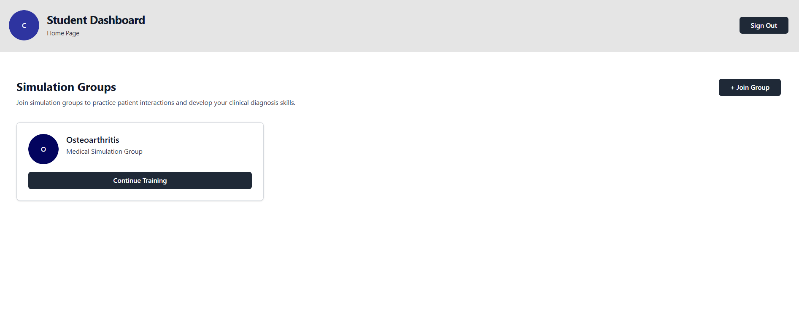

### Viewing Available Patients

Select a simulation group from your dashboard to view its available patient personas, then browse the list where each patient card displays the patient’s name, age, and gender to help you identify the scenario.

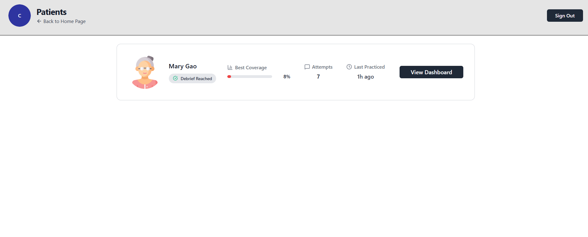

### Starting a Chat Session

Click on a patient persona to open the patient dashboard, then select **Start New Interaction** to begin a new conversation where you can enter your clinical questions and assessments in the message field. This enables simulated pharmacist–patient interactions, allowing you to practice clinical questioning and apply clinical reasoning, with the AI patient responding based on its configured case materials and persona.

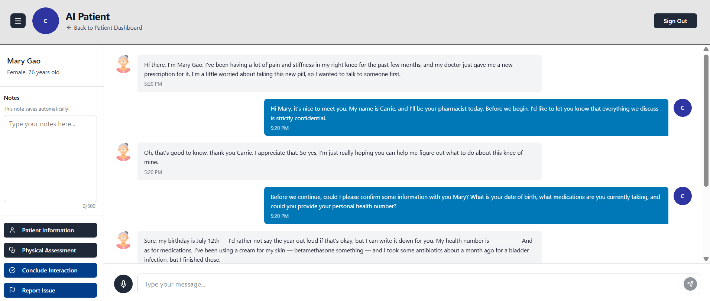

### Using Learning Media
Students can engage with embedded media (e.g., H5P) within virtual patient scenarios to support the development of physical assessment and clinical skills.

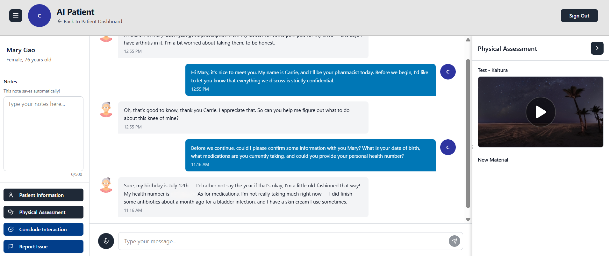

### Using Voice Chat

If voice is enabled for the patient, a **Voice** option appears in the chat interface. Users can click the voice button to start a voice session, where they can speak naturally with the AI patient and receive responses through synthesized speech. Users can also switch between text and voice at any point within the same session.

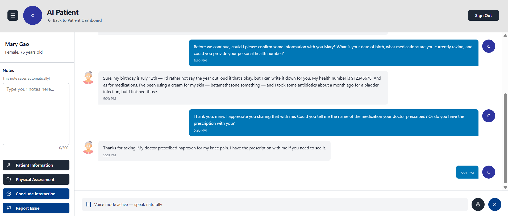

### Concluding an Interaction

After gathering all necessary information, click **Conclude Interaction**. Enter your clinical diagnosis, recommendations, and rationale in the provided form, then submit to complete the session. A debrief will be generated to evaluate your interaction.

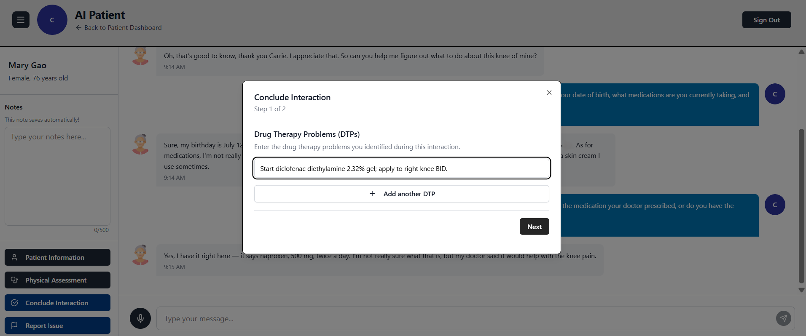

### Viewing Your Debrief

The debrief includes an AI-generated summary and evaluation of the user’s clinical interview, including identifying gaps in clinical reasoning, highlighting missed opportunities, and evaluating student assessments. A notice is included indicating that this content is AI-generated and should be used as guidance alongside your own clinical judgment, with any questions directed to your instructor.
  
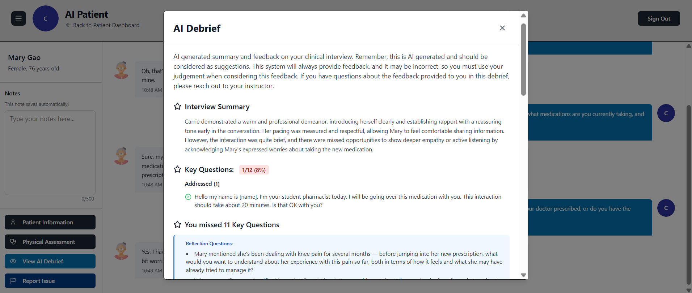

### Reviewing Chat History

From their dashboard, students can access past sessions, browse by simulation group and patient, and select any session to review the full interaction transcript and debrief.

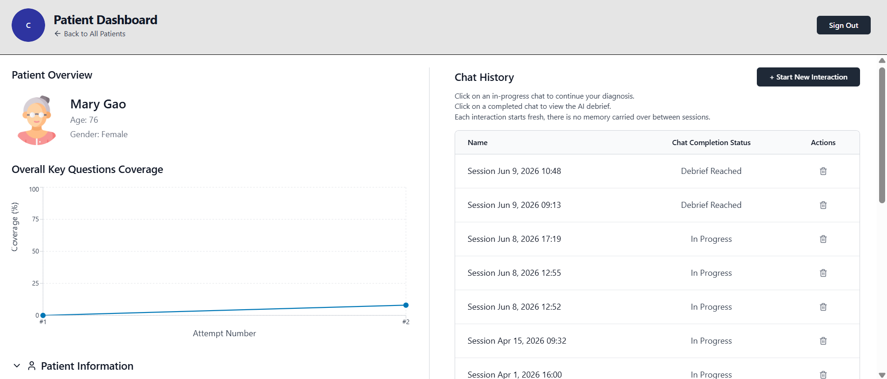

---

## Instructor Workflow

As an instructor, you design clinical simulation scenarios, manage student enrollment, and review performance analytics.

### Creating a Simulation Group

1. From your **Instructor Dashboard**, click **Create New Group**.
2. Provide a name and description for the group.
3. Toggle the active status of the group to make it available.

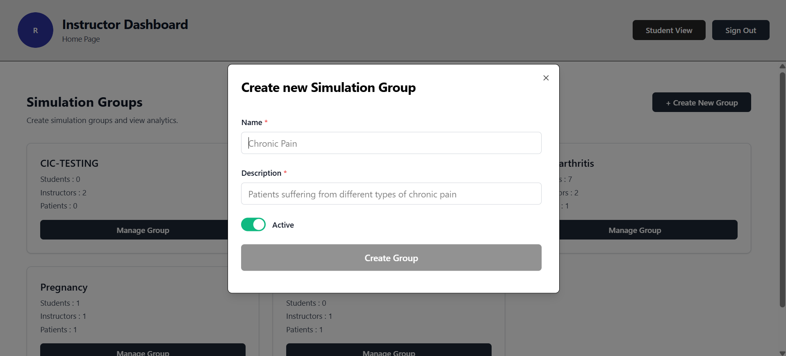

As an instructor, users can either create a new group or be manually assigned to an existing group by an admin user. It should look like so:

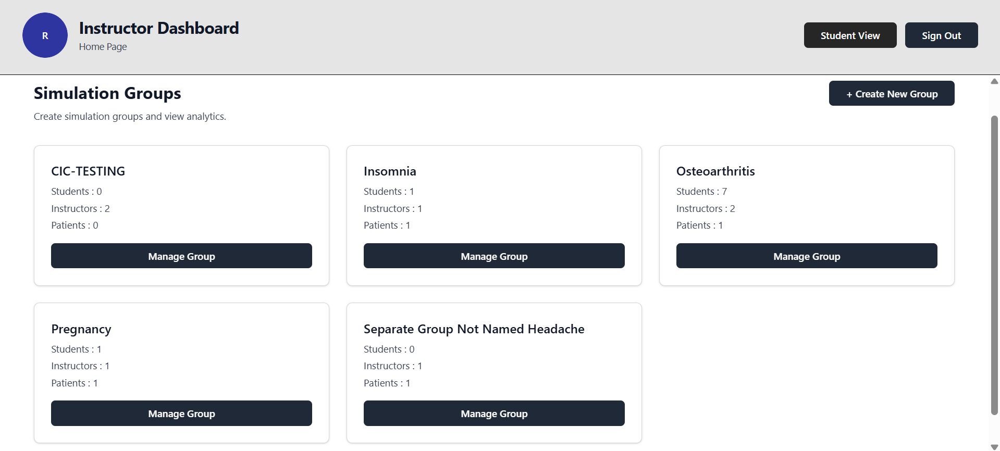

### Managing a Simulation Group

Instructors can open an existing simulation group from their dashboard to view cohort level insights including analytics, patient and student information as well as the ability to include/exclude bank items (Key Questions, DTPs and Recommendations) to be associated with the current simulation group (global) or per-patient in the simulation group.

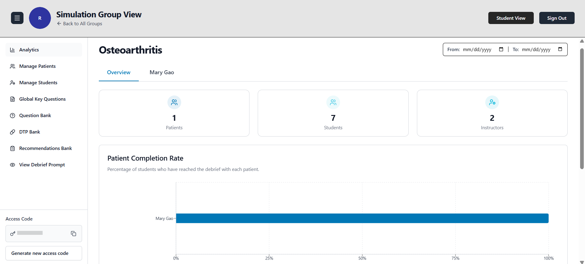

### Managing Patient Personas

1. Within a simulation group, navigate to the Manage Patients tab in the sidebar. Instructors will be able to view and edit the patients configured in the current simulation group, as well as add new patients.

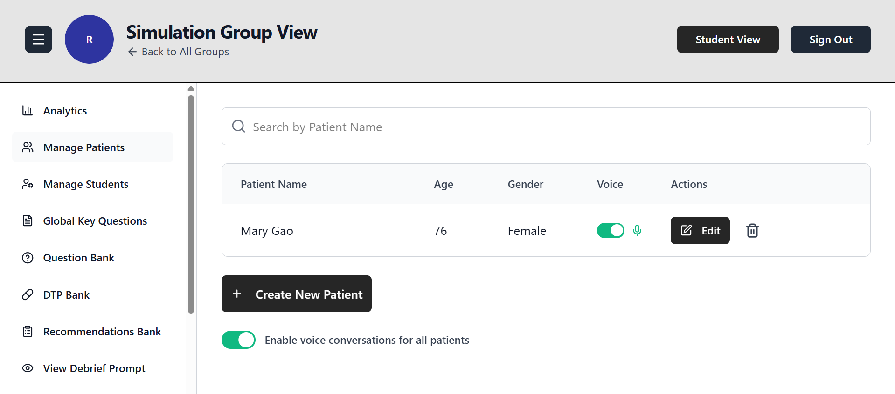

2. To create a new patient: click on **Create new Patient** to create a new persona.

#### Patient Information

Fill in the basic demographics for the scenario including the patient's name, age, and gender. These details are displayed to students on the patient card and help set the context for the clinical encounter.

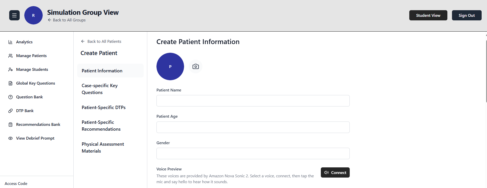

#### Voice Preview

Configure the voice settings for the patient persona. Select a voice profile and preview how the patient will sound during voice-enabled interactions. This allows instructors to choose a voice that matches the patient's demographics and personality.

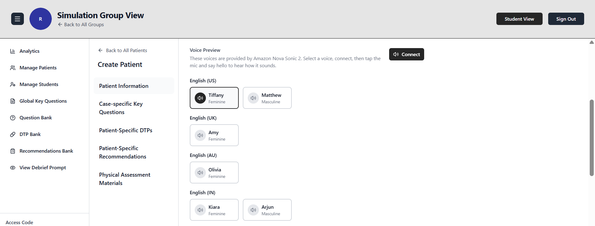

#### Text and Voice Prompts

Define the patient prompt that controls the AI patient's behavior during conversations. This includes instructions about the patient's personality and how they should respond to student questions. For voice-enabled patients, a separate voice prompt can be configured to tailor responses for spoken interactions.

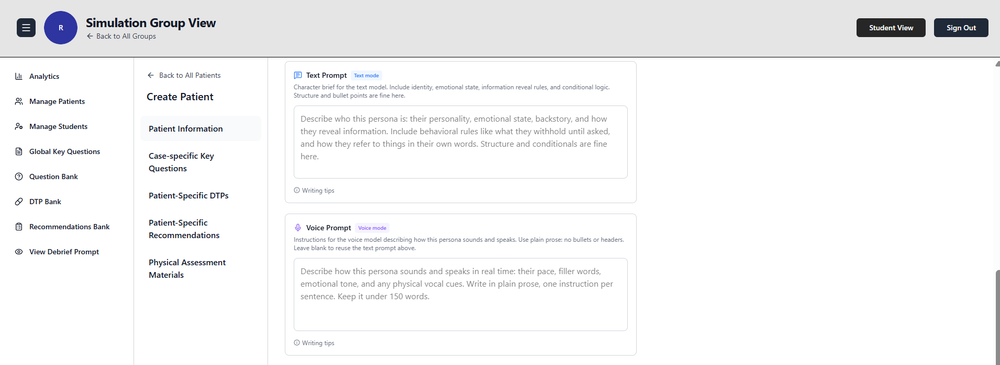

#### LLM Upload and Patient Information Upload

Upload case materials (PDF documents such as lab results, medical history, or clinical notes) that the AI uses as context during conversations. Additionally, upload any supplementary patient information files that help define the scenario. These documents are processed and made available to the AI to ensure clinically accurate responses.

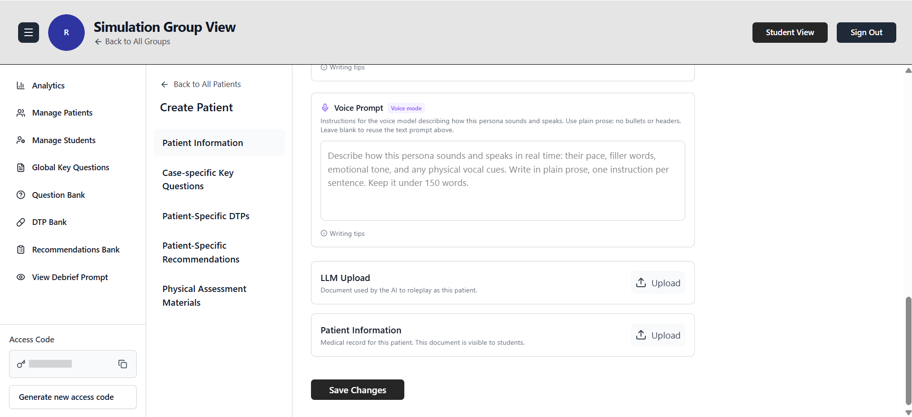

#### Saving the Patient

Once all patient details, prompts, and materials are configured, click **Save** to create the patient persona. The patient will then appear in the simulation group's patient list and be available to enrolled students.

### Editing an Existing Patient

To edit an existing patient, click the **Edit** button on the patient you want to modify. This opens the same patient creation form, pre-populated with the patient's existing information. You can update any field: demographics, voice settings, prompts, or uploaded materials — and save your changes.

In addition to the standard patient information fields, this form also allows instructors to inline edit patient-specific bank items including key questions, DTPs, and recommendations, as well as physical assessment materials for that patient.

### Managing Bank Items

Bank items are the clinical content used to evaluate student interactions. There are three types:

- **Key Questions** — questions students should ask during the patient interaction, used for semantic matching to detect when a topic is addressed
- **Drug Therapy Problems (DTPs)** — clinical issues students should identify during the interaction
- **Recommendations** — suggested actions or treatment plans students should propose to the patient

Within a simulation group, navigate to the respective tabs on the sidebar where you can manage all three types: Question Bank, DTP Bank, Recommendations Bank. Each type follows the same workflow:

1. **Switch between Global and Per-Patient tabs** — Global items apply across all patients in the group, while per-patient items are scoped to a specific persona.
2. **Include or exclude items** — Checklist items on or off to control which ones are active for evaluation.
3. **Expand items** — Click to expand any bank item to view its full content before deciding whether to include it.

#### Key Questions

The global tab shows all key questions available across the simulation group:

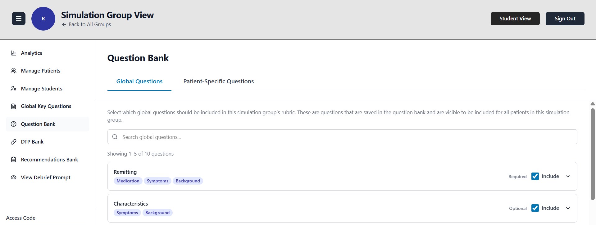

Switch to the patient-specific tab to manage key questions scoped to an individual patient:

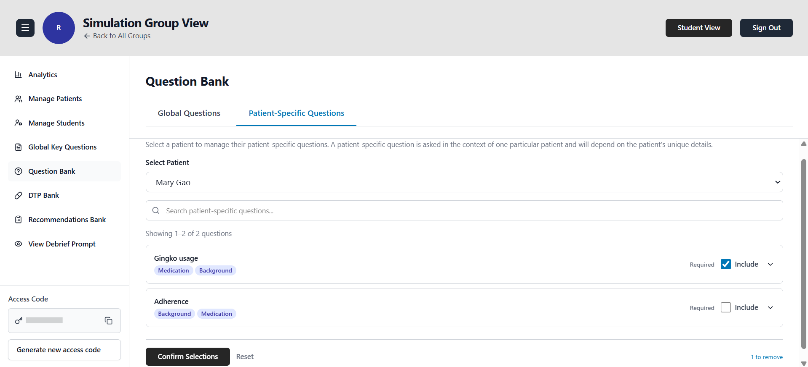

#### Drug Therapy Problems

The DTP bank displays available drug therapy problems. Expand any item to review its full content before including or excluding it:

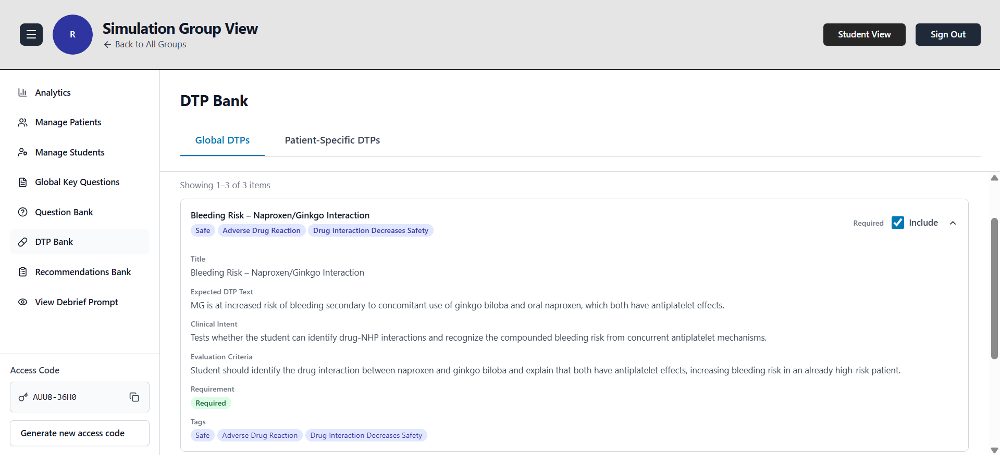

#### Recommendations

The recommendation bank works the same way — expand items to see full details and toggle inclusion as needed:

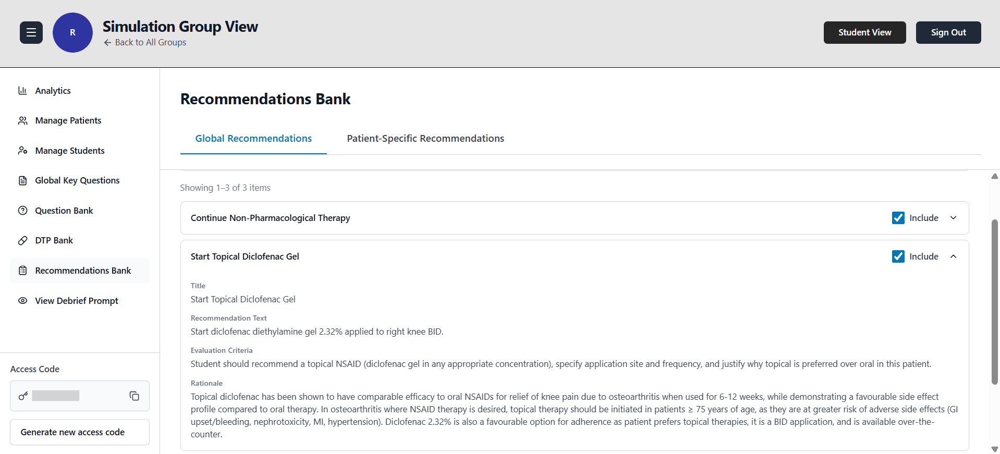

### Managing Enrollments and Reviewing Student Work

Share the access code with your students so they can join the simulation group. Within the group, navigate to **Manage Students** to view a list of all enrolled students along with their email addresses.

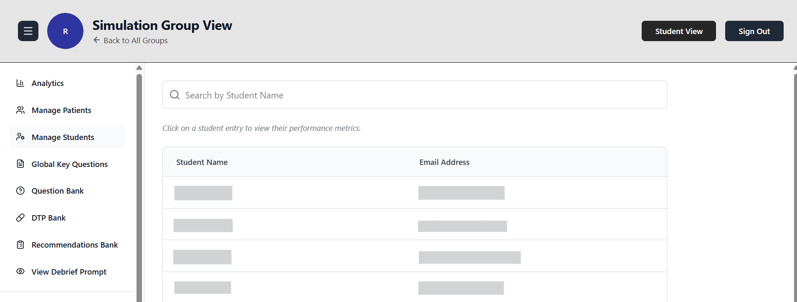

From here, instructors can drill into any individual student to view student-specific analytics including the number of cases completed and the percentage of interactions where a debrief was reached, as well as a list of all their interactions.

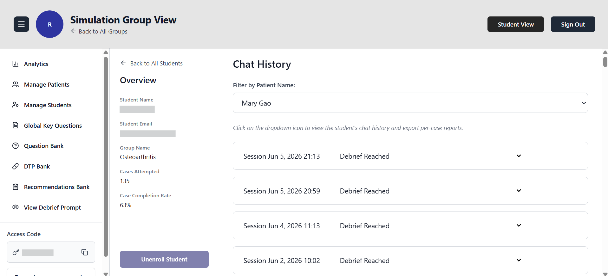

Select a particular interaction to review the full chat transcript between the student and the AI patient:

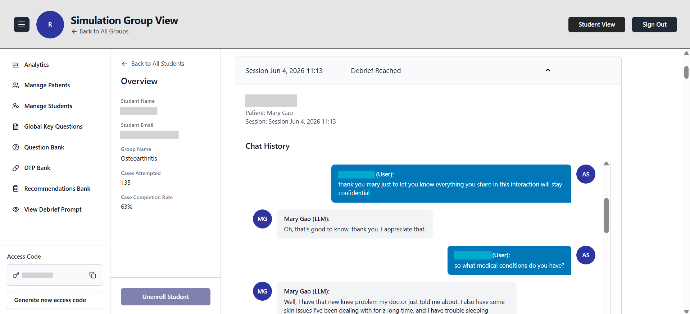

Instructors can also review student submissions and debriefs, and export chat transcripts and notes for record-keeping or further review:

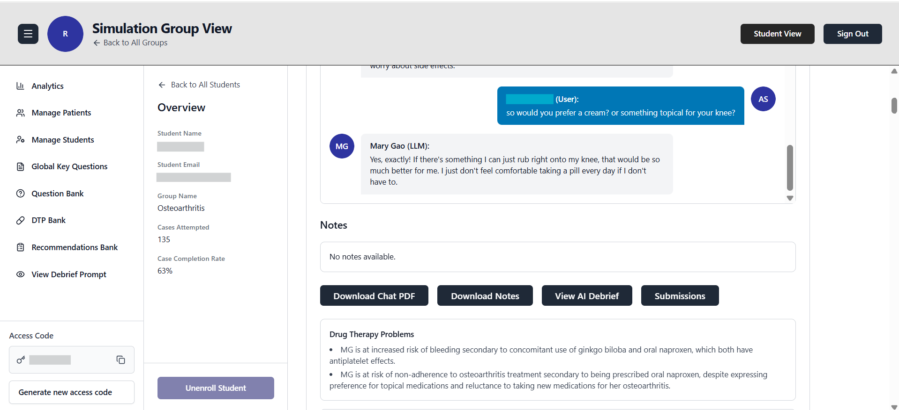

### Reviewing Analytics

From your simulation group page, access the **Analytics** section to view cohort-level engagement metrics including student completion rates and overall interaction trends.

Beyond the group overview, instructors can view more granular per-patient analytics. This includes the number of students who successfully asked each key question, giving insight into which clinical topics students are addressing or missing:

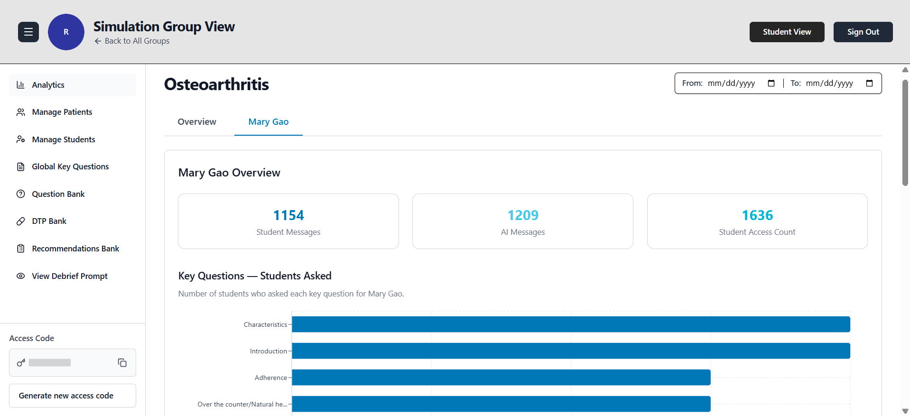

The message distribution chart shows the breakdown of student messages versus AI messages across interactions, helping instructors gauge how much students are actively engaging or if any interactions are going off the rails:

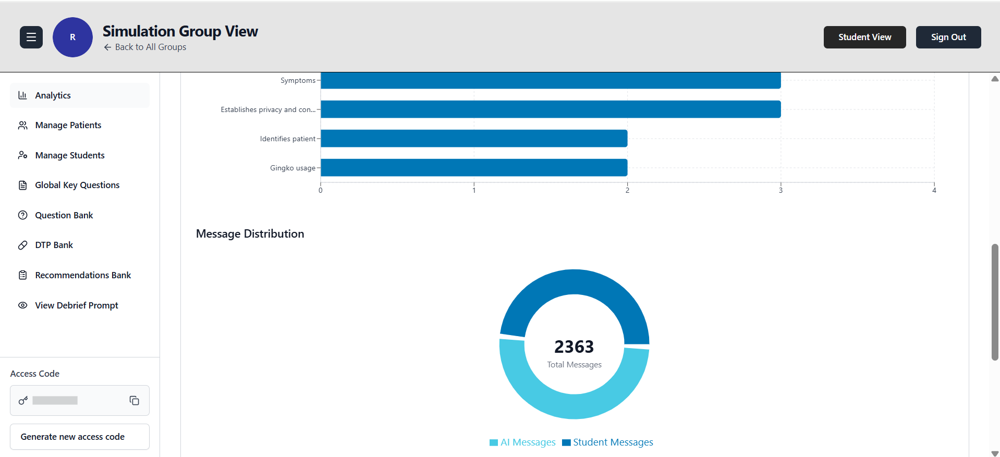

Student progress status provides a snapshot of where students are in their workflow — how many haven't started, how many are in progress, and how many have reached a debrief. Instructors can also hover over any bar in the chart to see the names of the students in that category.

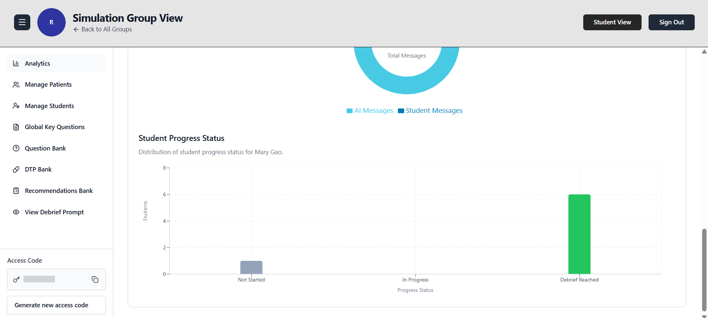

---

## Admin Workflow

As an administrator, you manage the organizational structure, assign roles, and maintain shared resources like question banks.

### Managing Organizations

1. From the **Admin Home**, select **Organizations**.
2. Create a new organization or select an existing one.
3. Configure organization details:
   - Organization name and description
   - Contact information
   - Associated instructors

### Assigning Instructors

1. Navigate to the organization management page.
2. Click **Assign Instructor** to add an instructor to the organization.
3. Search for the instructor by email.
4. Confirm the assignment — the instructor can now create simulation groups under this organization.

### Managing Question Banks

1. From the Admin Home, select **Question Banks**.
2. Create organization-level question banks that instructors can reference.
3. Add questions with tags for categorization.
4. Questions in the bank are available for semantic matching across all simulation groups in the organization.

### Managing DTP Recommendation Banks

1. Navigate to **Recommendation Banks** from the Admin Home.
2. Create and organize drug therapy problem (DTP) recommendations.
3. These recommendations serve as reference material for debrief evaluations.

### Viewing Simulation Groups

1. As an admin, you have visibility into all simulation groups across your organization.
2. Navigate to any group to review its configuration, enrolled students, and analytics.
3. Use this access for quality assurance and support purposes.

---

## FAQ

### General

**Q: Which browsers are supported?**
A: GenRx works best in modern browsers including Chrome, Firefox, Safari, and Edge. Ensure your browser is up to date for the best experience.

**Q: I forgot my password. How do I reset it?**
A: Click the **Forgot Password** link on the login page. Enter your email address and follow the instructions in the reset email.

**Q: Can I change my role?**
A: Roles are assigned by your institution's administrator. Contact your admin if you need a role change.

### Students

**Q: My access code isn't working. What should I do?**
A: Verify the code with your instructor. Access codes are case-sensitive. If the group has been archived or closed, the code may no longer be valid.

**Q: Can I redo a conversation with a patient?**
A: Yes. You can start a new chat session with the same patient at any time. Each session is tracked independently.

**Q: How is my debrief score calculated?**
A: The AI evaluates your conversation against the key questions configured by your instructor. It checks whether you addressed each clinical topic and compares your recommendation against the answer key.

**Q: Is voice chat available for all patients?**
A: Voice chat availability depends on your instructor's configuration. If the voice option is not visible, it has not been enabled for that patient.

### Instructors

**Q: How many patients can I add to a simulation group?**
A: There is no hard limit on the number of patients per group. Add as many scenarios as needed for your curriculum.

**Q: Can I edit a patient after students have started interacting?**
A: Yes, you can update patient prompts and case materials at any time. Changes apply to new sessions — existing conversations are not affected.

**Q: How do I upload case materials?**
A: When creating or editing a patient, use the file upload area to attach PDF documents. The system processes these documents and makes them available to the AI during conversations.

### Admins

**Q: Can I remove an instructor from an organization?**
A: Yes. Navigate to the organization page and manage instructor assignments from there. Removing an instructor does not delete their simulation groups.

**Q: How do question banks relate to individual patients?**
A: Organization-level question banks provide a shared pool of questions. Instructors can also add patient-specific questions. Both are used for semantic matching during student interactions.

---

## Related Documentation

For deployment and infrastructure details, see the [Deployment Guide](./DEPLOYMENT_GUIDE.md).
